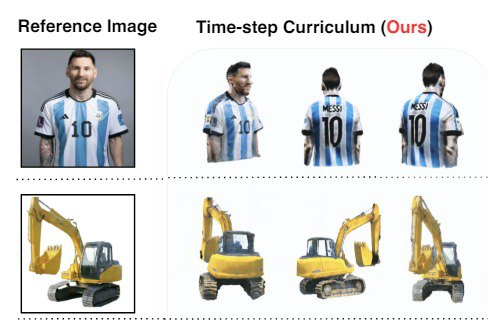

# Awesome 3D Generation

This repo collects papers connected with 3D generation.

## Table of Contents
- [Image-to-3D](#image-to-3d)
- [Text-to-3D](#text-to-3d)
- [Human Generation](#human-generation)

## Image to 3D
| Paper | Release | Code / Demo | Testing Specs | Testing Results |
| :---------------------------------------------------------- | :-------: | :-------: | :-----------: | :-----------: |
| [GRM: Large Gaussian Reconstruction Model for Efficient 3D Reconstruction and Generation](https://arxiv.org/abs/2403.14621) | 03.2024 | [Code (empty)](https://github.com/justimyhxu/GRM?tab=readme-ov-file)   [HuggingFace Demo](https://huggingface.co/spaces/GRM-demo/GRM) | Generation Time: 2 min  |   |
| [Magic-Boost: Boost 3D Generation with Mutli-View Conditioned Diffusion](https://arxiv.org/abs/2404.06429) | 04.2024 | [Code (empty) ](https://github.com/magic-research/magic-boost)   Planned release date: 05.2024 | Generation Time: 15 min GPU: A100 (40GB) |  |
| [Diffusion Time-step Curriculum for One Image to 3D Generation (CVPR 2024)](https://arxiv.org/pdf/2404.04562) | 04.2024 | [Code (empty) ](https://github.com/yxymessi/DTC123)   Planned release date: 06.2024 | Generation Time: 25 min GPU: A100 (40GB) |  |
| [Compress3D: a Compressed Latent Space for 3D Generation from a Single Image](https://arxiv.org/pdf/2403.13524) | 03.2024 | No code | Generation Time: 7 sec GPU: A100 (40GB) |  |
| [OpenLRM: Open-Source Large Reconstruction Models](https://arxiv.org/abs/2311.04400) | 11.2023 | [Code](https://github.com/3DTopia/OpenLRM) [Colab](https://colab.research.google.com/drive/15uq46FFdzEXUfOuR-TPEpZzfgrb2q-GO?usp=sharing) | Generation Time: 1 min GPU: 15Gb (base model), <40Gb (large model) |  |

## Human Generation
| Paper | Release | Code / Demo | Testing Specs | Testing Results |
| :---------------------------------------------------------- | :-------: | :-------: | :-----------: | :-----------: |
| [Portrait3D: Text-Guided High-Quality 3D Portrait Generation Using Pyramid Representation and GANs Prior](https://arxiv.org/pdf/2404.10394) | 04.2024 | [Code](https://github.com/oneThousand1000/Portrait3D) | Generation Time: 30 min GPU: 24GB No mesh reconstruction (only .mrc file) |   |